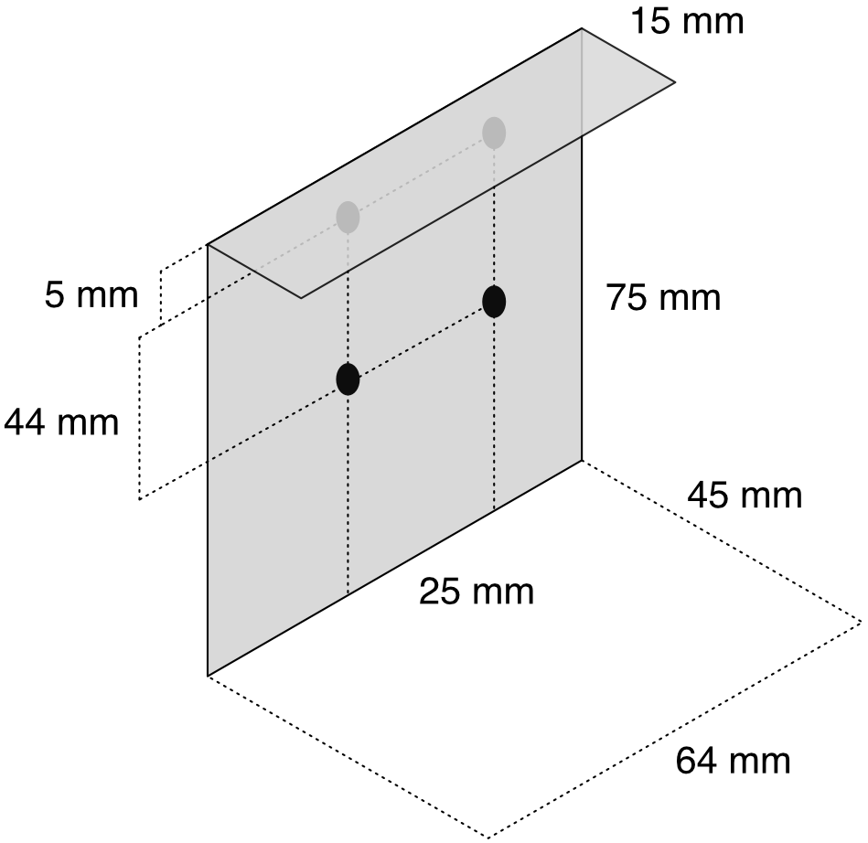

# Integrating a Sensor into the Waggle Platform

The purpose of this document is to describe the hardware and software
specifications a sensor must satisfy to be integrated into the Waggle platform.

## Physical Constraints

### Sizing and Assembly

The location for the sensor is roughly a rectangular volume of size 45mm x 75mm x 64mm. (*** check this and make diagram ***)

```
                64 mm
        *-------------------*
       /|                  /|
      / |                 / |
     *-------------------*  |  75
     |  |                |  |  mm
     |  |                |  |
     |  |                |  |
     |  |                |  |
     |  *----------------|--*
     | /                 | / 45
     |/                  |/  mm
     *-------------------*
```

There is a mounting plate with four holes available to mount a sensor. The holes are sized to fit M3 screws (3 mm diameter) with the spacing indicated by the following diagram. Note that the plate extends outward and intrudes into this region, leaving about 5 mm of head clearance. (*** make diagram ***)

```
---------------------
   5 mm vertical gap
    (x)--------(x)
     |  25 mm   |
     |          | 44
     |          | mm
     |          |
     |          |
    (x)--------(x)
```



### Interfaces

There are a number of options for connecting a sensor so it may be used including
USB, I2C, SPI, RS232 as well as connectivity through Ethernet or WiFi.

The preferred option is to use USB (for example, serial over USB) which simplifies
your task to only writing the node and server plugins described later in this document.

Alternatives to USB include I2C, SPI and RS232 which are connected through our
coresense board. The major disadvantage with these options is that it not only
requires you to write the node and server plugins, but you also must maintain
firmware adhering to the rather stringent requirement of transmitting data
in a coresense packet. This also means you have less control over what happens
to your data as it moves through the data pipeline.

### Power

Depending on which interface is used, your sensor must adhere to the following
power constraints.

* Using USB: 0.5A at 5V ???
* Using coresense: ... ???

### Network

A typical Waggle node may have limited network bandwidth. For example, the Array
of Things nodes are all transmitting over a wireless modem, which is somewhat
limited in both speed and available data usage. These are important considerations
when deciding on the both the rate and volume of data intended to be transmitted.
Our suggestion is to restrict the rate to at most one message to be sent every 10
seconds and that the message size is at most 1K.

## Software Design

Once a sensor is ready to be used with the Waggle platform, a node and server
side plugin pair must be written. The node side plugin needs to read data from
the sensor and prepare it to be pushed to the server. The server side plugin
handles any post-processing which needs to occur on the transmitted data from
the node side plugin. The exact requirements are detailed later, but first we
provide a real example of what each piece may be responsible for.

### Example: Coresense

The coresense is a PCB containing a collection of many different sensors. It
periodically sends a binary packet over a USB serial port containing readings
from each of the onboard sensors. The node side plugin reads this packet from
the serial port, checks it for validity and then sends it as-is to the server.
The server side plugin takes this packet, decodes the various readings from it
and forwards it further down the server side data pipeline.

## Plugin Architecture

The Waggle platform expects a node and server side pair of plugins to be
written. In order to indicate that these form a pair, a common plugin name and
version are to shared between the two pieces.

...probably better to give a simple new plugin example...

### Node Plugin

The node side plugin is responsible getting data from the sensor and forwarding
it to the cloud. To simplify this process, we'll assume that you'll be using
the pywaggle module we've provided at: https://github.com/waggle-sensor/pywaggle

```python
import waggle.pipeline
import time

class MyPlugin(waggle.pipeline.Plugin):

    plugin_name = 'myplugin'
    plugin_version = '1.0'

    def run(self):
        while True:
            self.send(sensor='mysensor', data='17.38')
            time.sleep(10)
```
